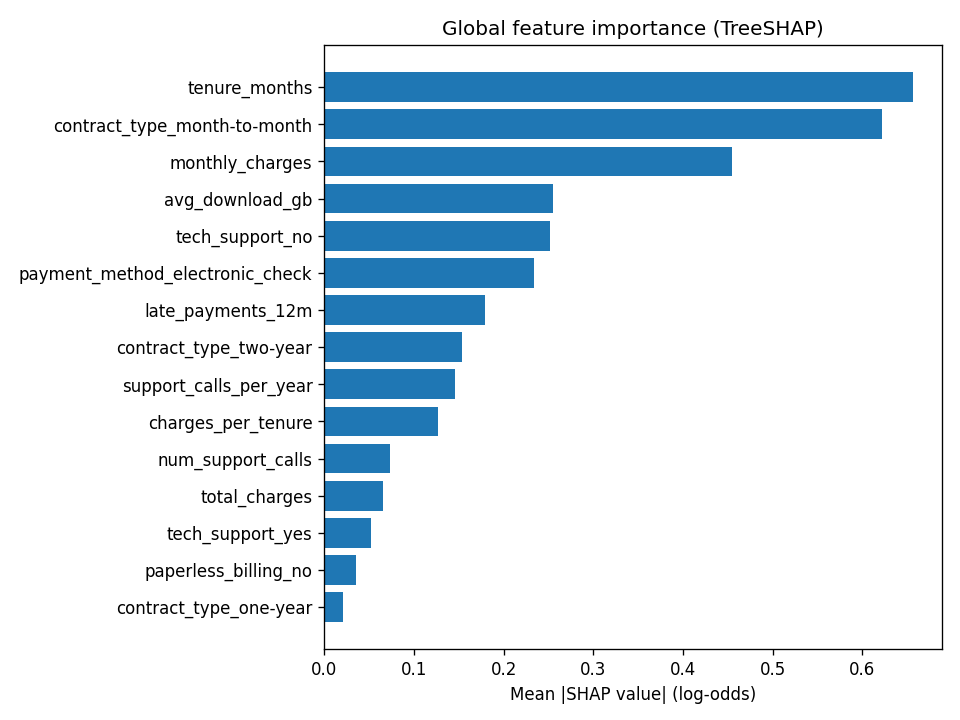
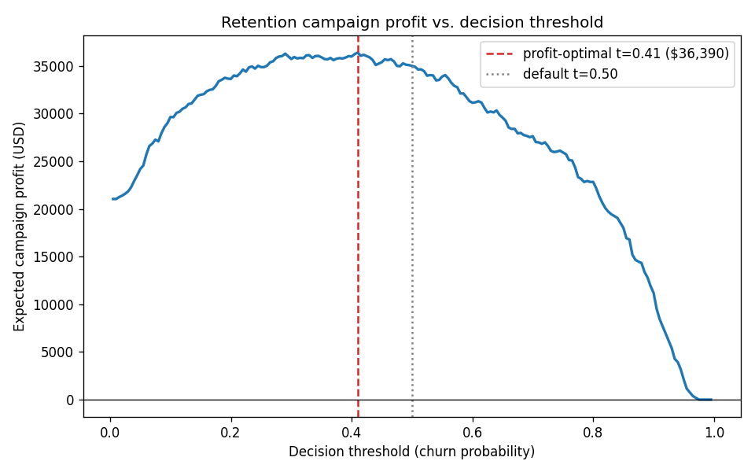

# Customer Churn Prediction Pipeline

An end-to-end, production-style ML pipeline that predicts telco customer churn and turns
probabilities into business decisions: synthetic data generation, sklearn feature
pipelines, model comparison, Optuna tuning, a profit-maximising decision threshold,
SHAP explanations, and a typed FastAPI service — all tested and containerised.

```
+-----------+    +------------------+    +----------------+    +-----------------+
| synthetic |    | feature pipeline |    |  train + tune  |    |    evaluate     |
| data gen  |--->| impute / scale / |--->| LR / RF / LGBM |--->| CV + holdout    |
| (seeded)  |    | one-hot + eng.   |    | Optuna (15 tr) |    | ROC/PR/F1/Brier |
+-----------+    +------------------+    +----------------+    +-----------------+
                                                                        |
                 +----------------+    +-----------------+    +-----------------+
                 |  FastAPI       |    | model registry  |    | business layer  |
                 |  /predict      |<---| joblib +        |<---| profit-optimal  |
                 |  /model/info   |    | metadata.json   |    | threshold, SHAP |
                 +----------------+    +-----------------+    +-----------------+
```

## Features

- **Synthetic dataset, honestly labelled as such** — ~5,000 telco-style customers from a
  seeded generator with a hand-designed nonlinear churn mechanism (tenure decay, a
  "promo cliff" around months 10–16, price/usage value mismatch, quadratic support-call
  effects) plus injected missing values. No real customer data anywhere.
- **Single sklearn `Pipeline`** — `ColumnTransformer` with median/mode imputation,
  scaling, one-hot encoding, and engineered features (tenure buckets, spend-per-tenure,
  support-call intensity). The same object trains, explains, and serves.
- **Model comparison with stratified 5-fold CV** — logistic regression baseline, random
  forest, and LightGBM, scored on ROC-AUC, PR-AUC, F1, and Brier.
- **Optuna hyperparameter tuning** — small seeded TPE study (15 trials) over LightGBM.
- **Imbalance handling** — class weights during training plus explicit threshold tuning
  afterwards, instead of pretending 0.5 is a decision.
- **Business-calibrated threshold** — given offer cost, churn loss, and offer save-rate,
  the pipeline sweeps the profit curve and serves the profit-maximising cut-off.
- **Explainability** — exact TreeSHAP global importance and a per-customer explanation
  (top churn-increasing and churn-decreasing factors as text and via the API).
- **Model registry light** — `model.joblib` plus a git-friendly `metadata.json` with
  metrics, threshold, hyperparameters, versions, and timestamp.
- **FastAPI serving** — `POST /predict` (with optional SHAP drivers), `POST /predict/batch`,
  `GET /health`, `GET /model/info`; strict pydantic v2 schemas (`extra="forbid"`, enums,
  range checks).
- **28 fast tests, ruff-clean, Dockerised** (python 3.11-slim, non-root user).

## Quickstart

```bash
# install
pip install -r requirements.txt

# train: generates data, compares models, tunes, calibrates the threshold,
# and writes model + metrics + plots to artifacts/
python -m churn_pipeline.train

# quick end-to-end demo (small dataset, ~15 s)
python -m churn_pipeline.demo

# serve the trained model
uvicorn churn_pipeline.api:app --host 0.0.0.0 --port 8000
```

Score a customer:

```bash
curl -s -X POST localhost:8000/predict -H 'Content-Type: application/json' -d '{
  "tenure_months": 3, "monthly_charges": 95.5, "total_charges": 290.0,
  "num_support_calls": 4, "avg_download_gb": 60.2, "late_payments_12m": 2,
  "contract_type": "month-to-month", "internet_service": "fiber",
  "payment_method": "electronic_check", "tech_support": "no",
  "paperless_billing": "yes"}'
```

Or with Docker (trains on first start if no artifacts are baked in):

```bash
make docker-build && make docker-run
```

Every knob is overridable via environment variables, e.g.
`CHURN_N_ROWS=10000 CHURN_N_TRIALS=30 python -m churn_pipeline.train`.

## Results

All numbers below are from the committed training run
(`python -m churn_pipeline.train`, seed 42, 5,000 synthetic rows, 29.6% churn rate,
1,000-row stratified holdout). **The data is synthetic**, so treat these as a
demonstration of the workflow, not a real-world benchmark.

Stratified 5-fold CV on the training split (default hyperparameters):

| Model               | ROC-AUC         | PR-AUC | F1    | Brier |
|---------------------|-----------------|--------|-------|-------|
| logistic regression | 0.827 ± 0.010   | 0.681  | 0.627 | 0.170 |
| random forest       | 0.826 ± 0.010   | 0.682  | 0.628 | 0.156 |
| lightgbm            | 0.815 ± 0.006   | 0.666  | 0.617 | 0.164 |

Optuna-tuned LightGBM (15 trials, 3-fold CV): **0.836** CV ROC-AUC.
Final holdout performance of the tuned model:

| Metric  | Holdout |
|---------|---------|
| ROC-AUC | **0.850** |
| PR-AUC  | 0.739   |
| F1 (t=0.5) | 0.664 |
| Brier   | 0.154   |

Note the honest finding: on this dataset the linear baseline is genuinely competitive
at default settings — the tuned LightGBM only pulls ahead after tuning (and more so as
the dataset grows). Baselines earn their keep.

Global SHAP importance of the final model:



## Business-calibrated threshold

A churn model is only useful once it triggers an action. Here the action is a retention
offer costing **$50**, a churned customer costs **$600** in lost revenue, and an offer
saves a true churner with probability **0.4** (all configurable in `config.py`). Expected
campaign profit as a function of the decision threshold:



On the holdout set the profit-maximising threshold is **0.41** with an expected profit of
**$36,390 per 1,000 customers** — versus the F1-optimal threshold of 0.555 and the naive
0.5 default. The served API applies the profit-optimal threshold from `metadata.json`.

Training also writes `profit_curve.png`, `shap_importance.png`, `roc_curve.png`,
`metrics.json`, and the model bundle to `artifacts/` (gitignored; the two plots above
are committed copies in `docs/`).

## Project structure

```
churn_pipeline/
  config.py        # pydantic-settings config (env-overridable, CHURN_ prefix)
  data.py          # seeded synthetic data generator + documented churn mechanism
  features.py      # engineered features + ColumnTransformer preprocessing
  models.py        # model factory: LR / RF / LightGBM pipelines
  evaluate.py      # stratified CV comparison, metric computation
  tuning.py        # Optuna study over LightGBM
  threshold.py     # profit curve + profit/F1-optimal thresholds
  explain.py       # TreeSHAP global importance + per-customer explanations
  persistence.py   # joblib + metadata.json save/load
  plots.py         # profit curve, SHAP importance, ROC plots
  train.py         # python -m churn_pipeline.train (full workflow)
  demo.py          # python -m churn_pipeline.demo (fast end-to-end)
  api.py           # FastAPI app
  schemas.py       # pydantic v2 request/response models
tests/             # 28 tests: data, features, models, threshold math, SHAP, API
docker/            # entrypoint (train-if-missing, then serve)
docs/              # committed result plots embedded above
```

## Design decisions

- **Everything behind one `Pipeline` object.** Imputation, scaling, encoding, and the
  model are fitted and persisted together, so training/serving skew is impossible by
  construction.
- **Class weights + threshold tuning, not resampling.** Weighted losses keep
  probabilities usable; the business layer then picks the operating point. SMOTE-style
  resampling would distort calibration for no gain here.
- **Profit, not accuracy, picks the threshold.** The optimizer maximises
  `TP * (save_rate * churn_loss − offer_cost) − FP * offer_cost`, and the profit curve
  makes the cost of the "default 0.5" visible.
- **SHAP via LightGBM's built-in TreeSHAP** (`pred_contrib=True`): exact Shapley values
  with zero extra runtime dependencies in the serving path; the `shap` package is used
  as a fallback for non-tree models.
- **Synthetic data by design.** The generator doubles as ground truth: we *know* the true
  drivers (contract type, tenure decay, promo cliff), so we can verify that SHAP recovers
  them — which it does (see plot above).
- **Metadata beside the model.** `metadata.json` records metrics, threshold,
  hyperparameters, library versions, and timestamp, so any served model is auditable.
- **Config over constants.** All knobs are pydantic-settings fields, overridable via
  `CHURN_*` env vars — which is also how the tests keep runtimes small.

## Testing

```bash
pytest        # 28 tests, ~5 s
ruff check .  # lint
```

Covered: generator determinism/schema/missingness, engineered features, preprocessing
shapes and NaN-freeness, probability sanity, model-beats-dummy (holdout AUC > 0.7),
save/load round-trip, threshold math on hand-computed toy cases, SHAP additivity
(contributions + base = raw score), explanation content, and every API endpoint
(validation errors included) via `TestClient` against a small model trained in a fixture.

## Roadmap

- Probability calibration (isotonic/Platt) with reliability diagrams.
- Drift monitoring on served inputs (PSI per feature) and a `/metrics` endpoint.
- MLflow-style experiment tracking instead of flat `metrics.json`.
- Batch scoring job + scheduled retraining example.
- CI workflow (lint + tests + Docker build) via GitHub Actions.
