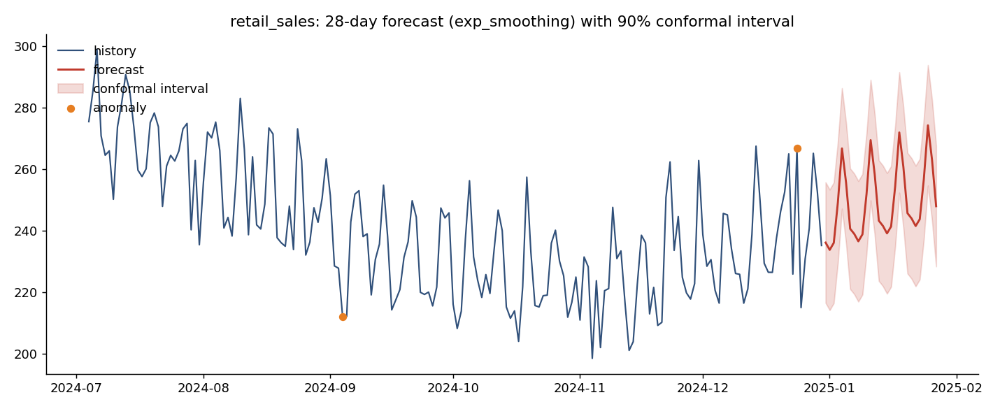
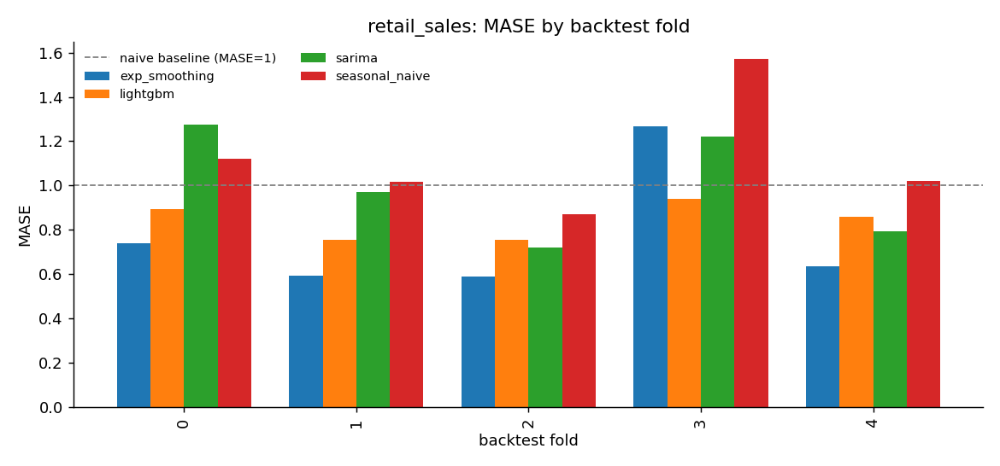

# ts-forecast

A multi-model time-series forecasting platform with rolling-origin backtesting,
automated model selection, and distribution-free conformal prediction intervals.

Four models — a seasonal-naive baseline, Holt-Winters exponential smoothing,
SARIMA, and LightGBM with engineered lag/rolling/calendar features — compete in
an expanding-window backtest. The winner (by MASE) is refit on the full history
and shipped with split-conformal intervals whose coverage is *measured* on a
held-out fold, not assumed.

## Architecture

```
                 +------------------+     +---------------------+
 CSV (date,value)|                  |     |  Rolling-origin     |
 ──────────────▶ |  Data loading /  | ──▶ |  backtest           |
 synthetic gen   |  validation      |     |  (expanding window) |
 ──────────────▶ |                  |     +----------+----------+
                 +------------------+                |
                                          MAE/RMSE/sMAPE/MASE per fold
                                                     |
        +------------------+              +----------▼----------+
        |  Model zoo       |◀────────────▶|  Model selection    |
        |  seasonal_naive  |  fit/predict |  (lowest mean MASE) |
        |  exp_smoothing   |              +----------+----------+
        |  sarima          |                         |
        |  lightgbm        |              +----------▼----------+
        +------------------+              |  Split-conformal    |
                                          |  intervals + honest |
                                          |  coverage check     |
                                          +----------+----------+
                                                     |
                 +------------------+     +----------▼----------+
                 | Anomaly flagging | ──▶ |  Reports: PNG plots,|
                 | (robust z-score) |     |  metrics.json, HTML |
                 +------------------+     +---------------------+
```

## Features

- **Common `Forecaster` interface** (`fit` / `predict(horizon)` / `name`) so
  models are interchangeable and the backtester stays model-agnostic.
- **Rolling-origin backtesting** with an expanding window: every fold trains a
  fresh model on data strictly before its test window (leakage is unit-tested).
- **Automated model selection** by mean MASE across folds.
- **Split-conformal prediction intervals** calibrated on backtest residuals,
  with the finite-sample quantile correction and empirically measured coverage
  on a held-out fold.
- **Anomaly flagging** on history via rolling robust z-scores (median/MAD) of
  seasonal-difference residuals.
- **Leakage-free feature engineering** for the LightGBM model: lags, rolling
  statistics over past-only windows, and calendar encodings.
- **Reproducible synthetic data**: three daily series (~3 years) with trend,
  weekly + yearly seasonality, holiday effects, level shifts and noise, all
  driven by one seed.
- **Reporting**: matplotlib PNGs, `metrics.json`, and a self-contained
  interactive plotly HTML report per series.

## Quickstart

```bash
pip install -r requirements.txt

# Full pipeline on the bundled synthetic data (writes plots to docs/)
python -m ts_forecast.demo

# Your own data: a CSV with columns date,value (daily)
python -m ts_forecast.run --csv my_series.csv --horizon 28 --folds 5

# Tests and lint
make test
make lint

# Docker
make docker-build && make docker-run
```

## Results

Backtest on the three synthetic series (5 expanding-window folds, 28-day
horizon, seed 42 — reproducible with `python -m ts_forecast.demo`). Mean
metrics across folds; MASE < 1 beats the seasonal-naive baseline. **Note:
these numbers are on synthetic data** and are meant to demonstrate the
methodology, not real-world performance.

### retail_sales — winner: exp_smoothing

| model          |    MAE |   RMSE | sMAPE % |  MASE |
|----------------|-------:|-------:|--------:|------:|
| exp_smoothing  |   7.63 |  10.17 |    3.31 | 0.764 |
| lightgbm       |   8.39 |  10.59 |    3.63 | 0.840 |
| sarima         |   9.95 |  12.58 |    4.26 | 0.997 |
| seasonal_naive |  11.19 |  14.25 |    4.82 | 1.121 |

### web_traffic — winner: exp_smoothing

| model          |    MAE |   RMSE | sMAPE % |  MASE |
|----------------|-------:|-------:|--------:|------:|
| exp_smoothing  | 132.86 | 176.71 |    2.16 | 0.787 |
| lightgbm       | 145.64 | 193.82 |    2.37 | 0.863 |
| sarima         | 156.04 | 205.25 |    2.52 | 0.924 |
| seasonal_naive | 189.01 | 232.06 |    3.06 | 1.120 |

### energy_demand — winner: exp_smoothing

| model          |    MAE |   RMSE | sMAPE % |  MASE |
|----------------|-------:|-------:|--------:|------:|
| exp_smoothing  |  20.38 |  26.73 |    2.51 | 0.780 |
| lightgbm       |  26.72 |  33.88 |    3.30 | 1.022 |
| sarima         |  31.23 |  38.60 |    3.85 | 1.194 |
| seasonal_naive |  36.99 |  45.46 |    4.43 | 1.417 |

Conformal 90% intervals, calibrated on the first four folds and evaluated on
the held-out fifth fold, achieved 96.4% / 92.9% / 96.4% empirical coverage on
the three series — slightly conservative, as expected from the finite-sample
quantile correction with 112 calibration residuals.





## Methodology

**Why rolling-origin backtesting?** A single train/test split gives one noisy
estimate of forecast error that depends heavily on where you cut. Rolling the
forecast origin forward across several folds (with an expanding training
window) evaluates each model at multiple points in time, averaging over local
regime effects — and it mirrors how the model would actually be re-trained and
used in production. Folds are strictly chronological: nothing after the origin
is ever visible at training time.

**Why MASE for selection?** MAE and RMSE are scale-dependent, so they cannot
be compared across series, and sMAPE degenerates near zero values. MASE scales
the forecast MAE by the in-sample error of a seasonal-naive forecast: it is
unit-free, well-defined for zero-valued data, and directly interpretable —
MASE < 1 means "better than the naive baseline you could have had for free."

**How the conformal intervals work.** The backtest yields out-of-sample
residuals for the winning model. Split-conformal prediction takes the absolute
residuals from the calibration folds and uses their `ceil((n+1)(1-α))/n`
empirical quantile as a symmetric interval half-width. Under exchangeability
this guarantees ≥ 1-α coverage with no distributional assumptions. Time-series
residuals are not perfectly exchangeable, so instead of leaning on the
guarantee, the pipeline calibrates on all folds except the last and *reports
the measured coverage* on the held-out final fold.

## Project structure

```
ts_forecast/
├── config.py        # pydantic-settings pipeline configuration
├── data.py          # synthetic generator + CSV loader
├── features.py      # leakage-free lag/rolling/calendar features
├── metrics.py       # MAE, RMSE, sMAPE, MASE
├── backtest.py      # rolling-origin backtest + model selection
├── conformal.py     # split-conformal intervals + coverage
├── anomaly.py       # robust z-score anomaly flagging
├── report.py        # matplotlib/plotly/JSON reporting
├── pipeline.py      # end-to-end orchestration
├── demo.py          # python -m ts_forecast.demo
├── run.py           # python -m ts_forecast.run --csv ...
└── models/
    ├── base.py      # Forecaster ABC
    ├── naive.py     # seasonal-naive baseline
    ├── ets.py       # Holt-Winters (statsmodels)
    ├── sarima.py    # SARIMA (statsmodels)
    └── gbm.py       # LightGBM, recursive multi-step
tests/               # 33 tests: determinism, leakage, metric math, coverage
docs/                # committed plots + metrics.json from the demo run
```

## Design decisions

- **Factories, not instances, in the backtest.** Each fold constructs a fresh
  model, making state carry-over between folds impossible by construction.
- **Fixed small SARIMA order** (1,1,1)(1,0,1,7) instead of a per-fold grid
  search: keeps backtests fast and avoids overfitting the order selection to
  one series. The interface makes swapping in `auto_arima`-style search easy.
- **Recursive multi-step for LightGBM** rather than one model per horizon
  step: a single model, simpler to maintain, at the cost of some error
  accumulation at long horizons — which the backtest measures honestly.
- **Rolling windows are computed on `y.shift(1)`** so a feature row at time
  `t` can never see `y[t]`; a dedicated test corrupts the "future" and asserts
  features are unchanged.
- **Constant-width intervals** (pooled over horizon steps) keep the conformal
  math exact; per-step widths would need far more calibration folds to be
  reliable.
- **Selection by MASE, reported alongside MAE/RMSE/sMAPE** so the choice is
  transparent and auditable in `metrics.json`.

## Testing

33 pytest tests (`make test`, ~8s) cover:

- generator determinism (same seed → identical bytes, different seed → different)
- feature engineering leakage (corrupting future values leaves past features untouched)
- backtest fold boundaries (contiguous, non-overlapping, expanding; a spy model
  proves training data always ends before the test window)
- MASE/sMAPE/MAE/RMSE against hand-computed toy cases
- conformal quantile math and empirical coverage on i.i.d. noise (within tolerance)
- every forecaster's output length, finiteness and date alignment
- model selection picking the lower-MASE model in a rigged contest
- anomaly detection catching an injected spike with a low false-alarm rate
- end-to-end pipeline artifacts (plots, HTML, metrics.json)

## Roadmap

- Per-horizon-step conformal widths (requires more calibration folds)
- Optional exogenous regressors (promotions, weather) for the LightGBM model
- Hierarchical/grouped series with reconciliation
- Model persistence and a lightweight serving endpoint
- CI workflow running lint + tests on push
