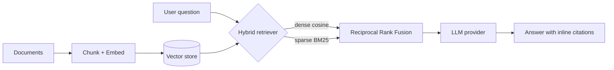
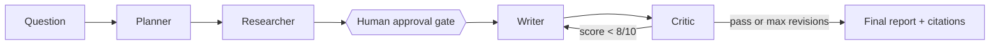

# Applied AI / ML Engineering Portfolio — Subrat Sushant


Eight end-to-end AI/ML engineering projects — spanning **RAG, LLM agents, MLOps, and QLoRA fine-tuning** — built with typed Python, pluggable interfaces, and **309 deterministic tests**. Every demo runs **fully offline** (no API key or model download required), with optional OpenAI/Anthropic backends via environment variables. The emphasis throughout is production-quality code and *honest* metrics.

> All metrics below are computed on bundled synthetic data with fixed seeds, so results are reproducible on any machine.

---

## 🧭 Recruiters — start here

| # | Project | What it does | Headline result | Core stack |
|---|---------|--------------|-----------------|------------|
| 01 | [**RAG Knowledge Base**](./01-rag-knowledge-base) | Hybrid **BM25 + dense** retrieval with reciprocal-rank fusion and **cited** answers | 45 offline tests; inline citations back to source chunks | FastAPI · NumPy · Docker |
| 02 | [**Multi-Agent Researcher**](./02-multi-agent-researcher) | 4-agent (Planner→Researcher→Writer→Critic) report writer with a **human approval gate** | 32 tests; bounded revision loop gated at 10/10 critic score | LangGraph · LangChain |
| 03 | [**MCP Analytics Server**](./03-mcp-analytics-server) | MCP server exposing **read-only SQL** analytics with 3-layer write protection | 56 tests; deny-by-default SQL authorizer resists prompt injection | FastMCP · SQLite · Pydantic |
| 04 | [**Churn Prediction Pipeline**](./04-churn-prediction-pipeline) | Telco churn model with a **profit-optimized** decision threshold | ROC-AUC **0.850**, PR-AUC 0.739; threshold 0.41 → **$36.4k profit / 1k customers** | LightGBM · Optuna · SHAP · FastAPI |
| 05 | [**Time-Series Forecasting**](./05-time-series-forecasting) | Multi-model forecasting with rolling backtests and **conformal** intervals | sMAPE ~2–3%, MASE ~0.78; 90% intervals cover **93–96%** | statsmodels · LightGBM · Plotly |
| 06 | [**MLOps Pipeline**](./06-mlops-pipeline) | MLflow registry with **policy-gated promotion** and drift-triggered retraining | 33 tests; PSI/KS drift detection + Prometheus metrics | MLflow · FastAPI · Prometheus · Docker |
| 07 | [**Agent Eval Framework**](./07-agent-eval-framework) | **Trajectory-level** LLM-agent evaluation (not just final answers) with CI gating | 26 tests; GoodAgent 0.987 vs SloppyAgent 0.509 overall | Pydantic v2 · pytest |
| 08 | [**LLM Fine-Tuning (QLoRA)**](./08-llm-finetuning-qlora) | QLoRA instruction-tuning toolkit with a **CPU-testable** core | 56 tests; 4-bit base, ~0.5% trainable params | PyTorch · PEFT · TRL · BitsAndBytes |

**Short on time?** Start with **04 (Churn)** for classic ML + business framing, **01 (RAG)** and **02 (Agents)** for LLM systems, and **06 (MLOps)** for production engineering.

---

## Why this portfolio is different

- **It runs.** Every project has a one-command offline demo — a reviewer can clone and see it work in seconds, no keys needed.
- **It's tested.** 309 deterministic tests across the suite, all ruff-clean, wired into CI.
- **It's honest.** Metrics come from reproducible synthetic data with stated seeds; where a number is illustrative (e.g., the QLoRA eval), the README says so.
- **It's typed and modular.** pydantic v2 models, pluggable provider interfaces, and clear separation between CPU-testable logic and GPU/heavy paths.

## Flagship architecture — RAG Knowledge Base (01)



## Flagship flow — Multi-Agent Researcher (02)



## Tech foundation

**Language & tooling:** Python 3.11 · pydantic v2 · FastAPI · pytest · ruff · Docker · GitHub Actions
**ML & data:** scikit-learn · LightGBM · Optuna · SHAP · statsmodels · NumPy
**LLM & agents:** LangGraph · LangChain · MCP (FastMCP) · PEFT · TRL · BitsAndBytes
**MLOps:** MLflow · Prometheus · conformal prediction · drift detection (PSI/KS)

## Running any project

```bash
cd <project-folder>
pip install -r requirements.txt
python -m <package>.demo        # offline, deterministic demo
# optional hosted LLM:  export <PROVIDER>_API_KEY=...  &&  export ..._PROVIDER=openai
```

Each folder has its own README with the exact commands, architecture, and full metrics.

---

**Subrat Sushant** — Applied AI / ML Engineer · M.S. Information Technology & Analytics, Rutgers (Dec 2026)
📧 subrat.sushant@gmail.com · [LinkedIn](https://www.linkedin.com/in/subrat-sushant/) · [GitHub](https://github.com/subratsushant05)
